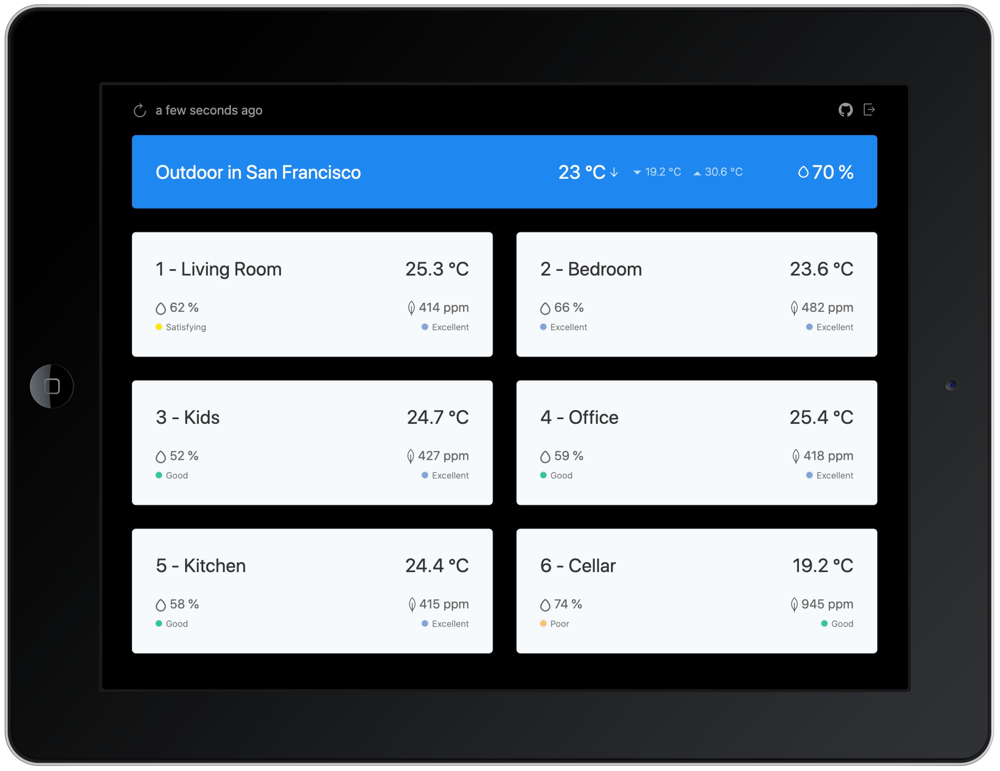

# My Home &middot; 

My Home is a simple dashboard to visualize temperature, humidity and co2 values
from my Weather Station and Healthy Home Coach from Netatmo. It's running on an
iPad and hanging on my wall in the living room.

## Get it too

The dashboard is available at https://myhome.ctor.io. If you own a Netatmo
Weather Station or a Healthy Home Coach (or both) you can login with your
Netatmo account and use the dashboard.

## License

MIT License (MIT) &copy; [Kevin Brechbühl](https://github.com/aquasonic)
